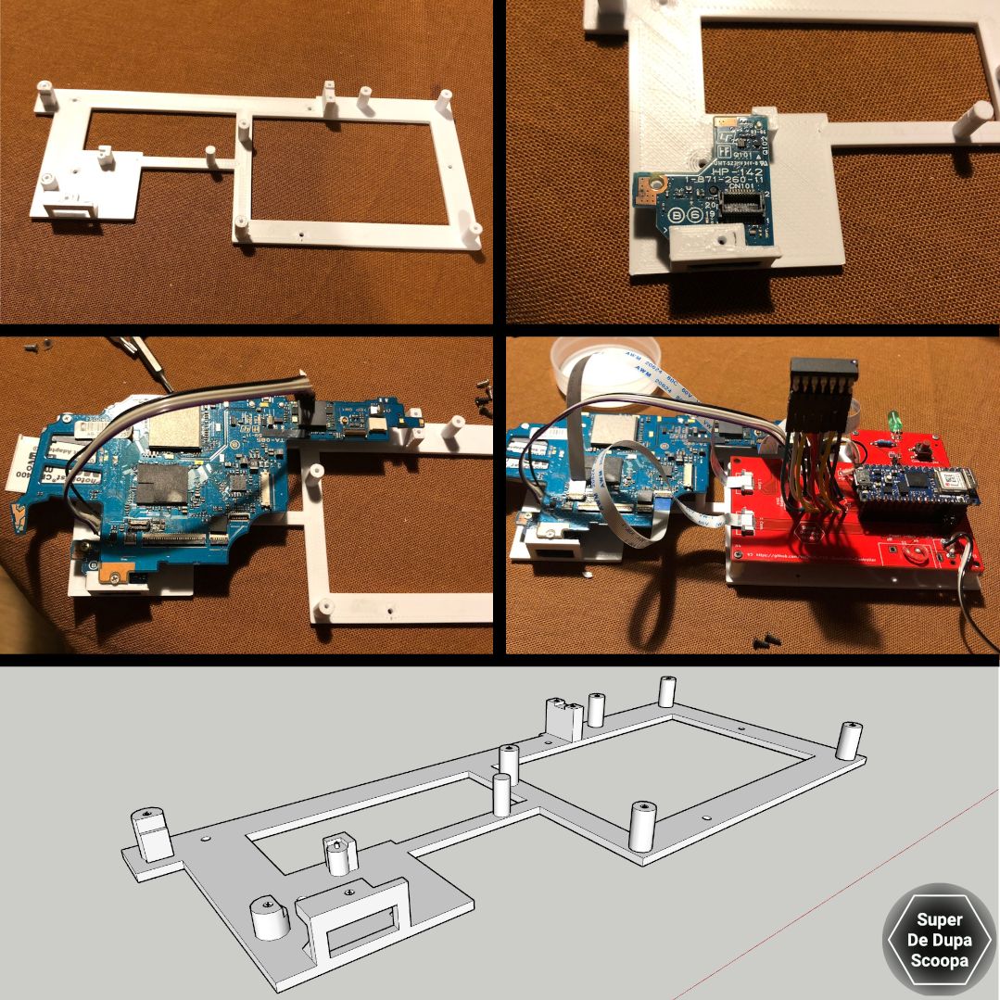
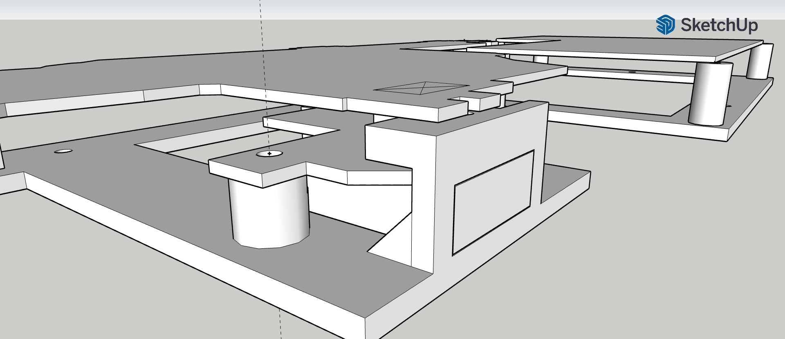

# 3d Models

This is a model to mount the PSP-2000 motherboard, tv out board and the PSP-Consolizer board.

    

---

⚠ **NOTE** The model is *far* from finished. It has multiple flaws mentioned below

---

The model was designed in Sketchup. I have exported the model in multiple files so that it should be compatible with different version of Sketchup, however i havent tested them.

There is also the `.stl` file if you just wish to print it.

## Why

The model was needed, IMHO, because the PSP-2000 model has a seperate board to deal with TV out. The 3000 model has this integrated into the motherboard. 

I figured it would be a pain to try and mount the motherboard and tv out in a DIY shell so designed this to give me a secure platform to build a custom shell around.

    

It just about does the job.

## Flaws

This is the first and only model i have designed, as a result it is rather terrible. I don't have a 3D printer so don't have the luxury of quick and cheap test prints.

Here is a list of its issues (there are probably many more due to poor design)

* Not all screw holes line up
* Base could do with being thicker, there is a little flex.
* very small overhangs around the TV Out board. This means supports are needed. However they are very difficult to remove without damaging the bits being supported.
* The test print i had made had odd artifacts around the screw posts, they weren't one solid post but looked like a post around another post. No idea what happened there.
* There is a capping piece missing from the model for the mounting point to the far right of the PSP's motherbaord.

All that being said it does its intended job, it holds things so thats good enough for me.