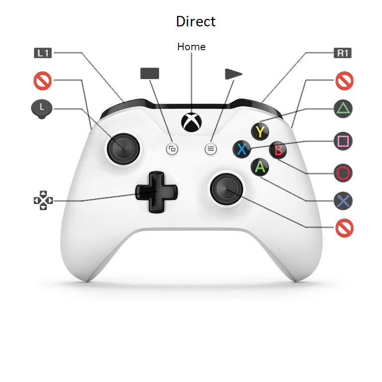
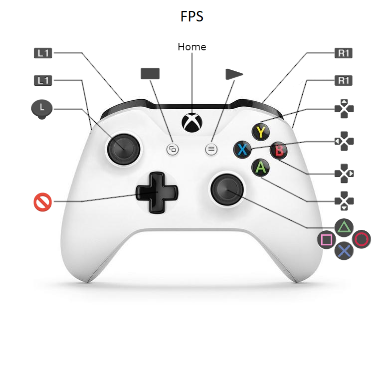
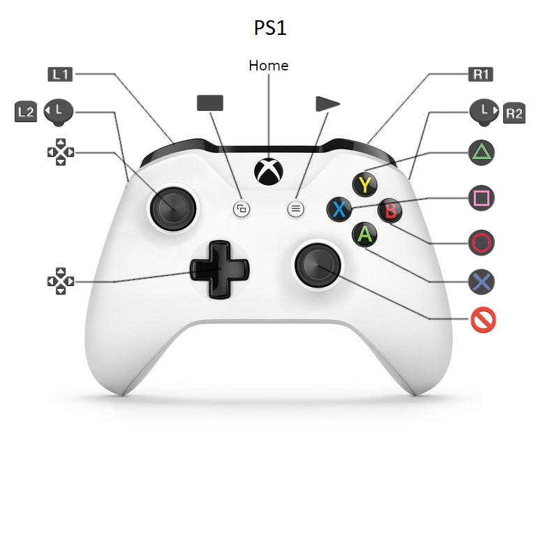

# Mappings

It is possible to map controller buttons to PSP buttons. Either of the controllers analog sticks (for controllers with more than one) can be mapped directly to the PSP's stick, they can also be mapped to four PSP buttons each. Finally it is possible to map controller buttons to the four directions of the analog stick (up, down, left, right).

Mappings are managed by setting three bits of information, the PSP button or analog stick to be mapped to, the controller button or analog stick to use as a trigger and the group the controller buttons lives in. This group is needed as the way the controller buttons are read varies depending on the group they are part of.

--------------------
⚠ *NOTE* 

Mappings are not meant to be user editable yet. This is for my benifit!

--------------------

## Controller buttons and groups

The following table lists the controller buttons and the group they live in.

| Controller Button | Group | Description |
|-------------------|-------|-------------|
| BUTTON_A | TYPE_BUTTONS | |
| BUTTON_B | TYPE_BUTTONS | |
| BUTTON_X | TYPE_BUTTONS | |
| BUTTON_Y | TYPE_BUTTONS | |
| BUTTON_THUMB_R | TYPE_BUTTONS | |
| BUTTON_THUMB_L | TYPE_BUTTONS | |
| BUTTON_SHOULDER_L | TYPE_BUTTONS | Top shoulder button L1 etc |
| BUTTON_SHOULDER_R | TYPE_BUTTONS | Top shoulder button R1 etc |
| BUTTON_TRIGGER_L | TYPE_BUTTONS | Bottom shoulder button (if controller has one) L2 etc |
| BUTTON_TRIGGER_R | TYPE_BUTTONS | Bottom shoulder button (if controller has one) R2 etc |
| BUTTON_BRAKE | TYPE_TRIGGER | Left analog trigger (if controller has one) like the Xbox one controller |
| BUTTON_THROTTLE | TYPE_TRIGGER | Right analog trigger (if controller has one) like the Xbox one controller |
| DPAD_UP | TYPE_DPAD | |
| DPAD_DOWN | TYPE_DPAD | |
| DPAD_LEFT | TYPE_DPAD | |
| DPAD_RIGHT | TYPE_DPAD | |
| MISC_BUTTON_SYSTEM | TYPE_SYSTEM | System button (Xbox logo etc) |
| MISC_BUTTON_BACK | TYPE_SYSTEM | Select button or equivilent |
| MISC_BUTTON_HOME | TYPE_SYSTEM | Start button or equivilent |
| BUTTON_RS_UP | TYPE_RS | Analog stick used as a button. On or of in this direction |
| BUTTON_RS_DOWN | TYPE_RS | Analog stick used as a button. On or of in this direction |
| BUTTON_RS_LEFT | TYPE_RS | Analog stick used as a button. On or of in this direction |
| BUTTON_RS_RIGHT | TYPE_RS | Analog stick used as a button. On or of in this direction |
| BUTTON_RS | TYPE_RS | Analog stick being directly mapped to the PSP's analog stick |
| BUTTON_LS | TYPE_RS | Analog stick being directly mapped to the PSP's analog stick |

## PSP buttons

The following lists the PSP buttons a controller button or analog stick can be mapped too.

| Button | Description |
|--------|-------------|
| PSP_HOME | |
| PSP_START | |
| PSP_SELECT | |
| PSP_DISPLAY | |
| PSP_L1 | |
| PSP_R1 | |
| PSP_DUP | |
| PSP_DDOWN | |
| PSP_DLEFT | |
| PSP_DRIGHT | |
| PSP_TRIANGLE | |
| PSP_CROSS | |
| PSP_SQUARE | |
| PSP_CIRCLE | |
| PSP_LS | For when a controller analog stick is being directly mapped |
| PSP_LS_UP | For when a controller button is mapped to the PSP's analog stick *up* position |
| PSP_LS_DOWN | For when a controller button is mapped to the PSP's analog stick *down* position |
| PSP_LS_LEFT | For when a controller button is mapped to the PSP's analog stick *left* position |
| PSP_LS_RIGHT | For when a controller button is mapped to the PSP's analog stick *right* position |

# Examples

## Maping a controller button to a psp's button
This maps the controllers `A` button to the psp's `Cross` button.

`{ PSP_CROSS, BUTTON_A, TYPE_BUTTONS  }`

## Maping a controller trigger to a psp's button
This maps the right trigger (if the controller has one, ala Xbox one) to the PSP's `R1` button.

`{ PSP_R1, BUTTON_THROTTLE, TYPE_TRIGGER }`

## Maping a conroller analog stick to a psp's button
This maps the controllers right analog stick up position to the PSP's `Triangle` button.

`{ PSP_TRIANGLE, BUTTON_RS_UP, TYPE_RS }`

## Maping a controller analog stick to the psp's analog stick
This directly maps the controllers left stick to the PSP's analog stick.

`{ PSP_LS, BUTTON_LS, TYPE_LS }`

## Maping a controller button to the psp's analog stick

This maps the controllers `L1` button to the psp's analog stick `Right` position.

`{ PSP_LS_RIGHT, BUTTON_SHOULDER_L, TYPE_BUTTONS }`

# Builtin mappings

There are three default mappins which can be toggled by pressing the select button. For controllers with player indicators they will show the mapping. The controller with vibrate slightly when chaning mapping.

### Default

### FPS Mapping

### PS1 Mapping

⚠ *Note*

The PSP does not support dual shock PS1 controllers. It is not possible to map to either of the PS1's analog sticks. Only the PSP GO with a PS3 controller could map to the left analog stick.