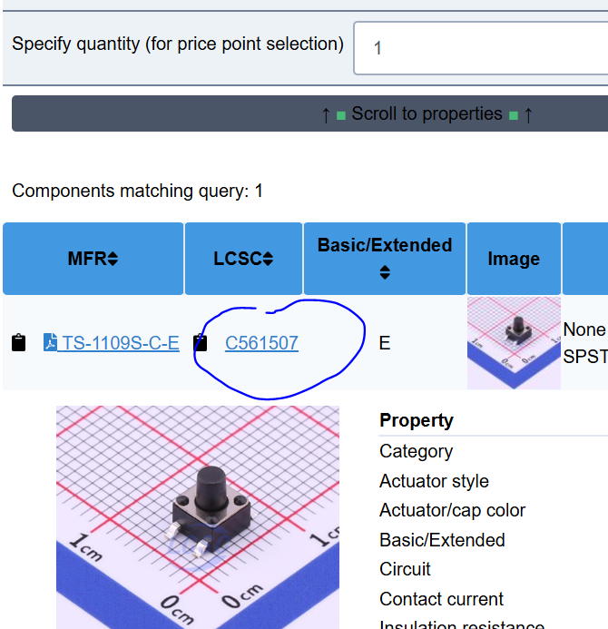
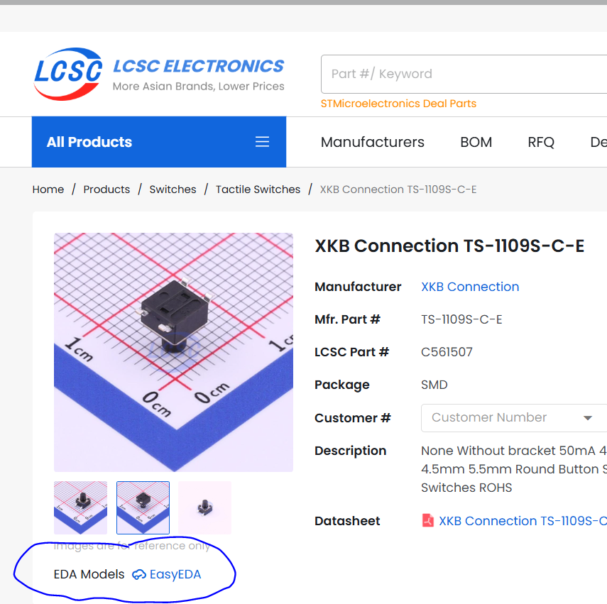
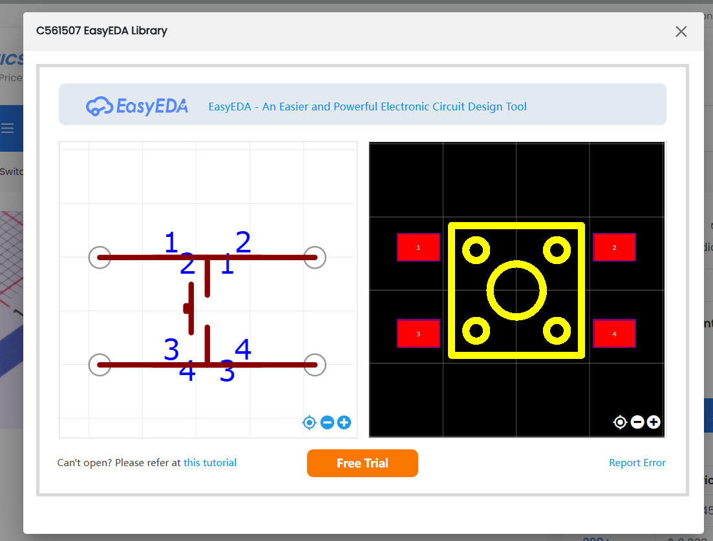
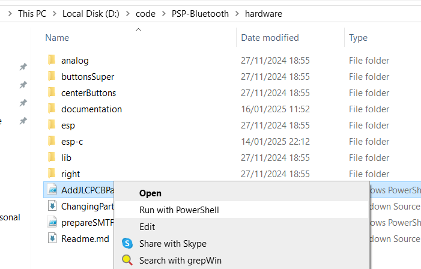
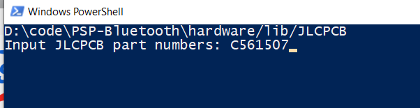
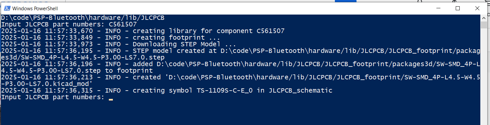
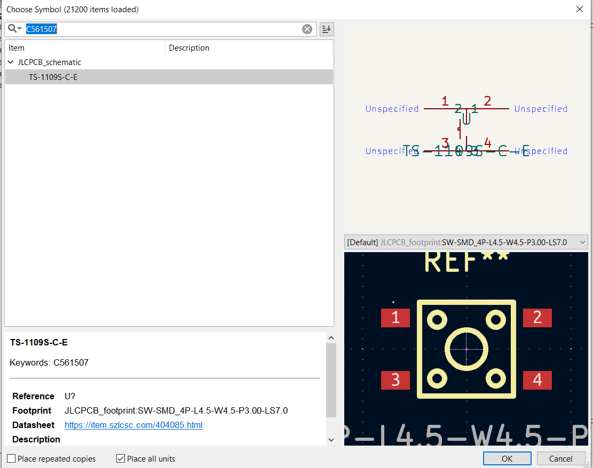

# Changing Parts

Sometimes it may be required to change parts, should some go out of stock.

This is my proccess.

## 1: Find the part

Using JLCPcb's part search is terrible IMHO. Instead i use a 3rd party here: [https://yaqwsx.github.io/jlcparts](https://yaqwsx.github.io/jlcparts).

The first time its used it will load up internally all the available parts to make them searchable. After that you have very fine grained search criteria to find exactly what you want.

### Considerations:
**Pick parts with footprints**. Whilst you can make your own, pick parts that have footprints.

Once you have found a part, click its part number.

Then look the for `EasyEDA` button and click it.

Then you can check its footprints.

Once you have found a part take note of its part number.

## 2: Add the part the the JLCPCB parts library

I run a script giving it the part number noted above. That script will download footprints for us and add them to a library linked to the projects in the repo. You can then use that part in any schematics.

**Don't have any projects open whilst running this script** Otherwise parts may not be available for use untill you close and re-open the Kicad project.

This script used a 3rd party python tool which can be installed from here: [https://github.com/TousstNicolas/JLC2KiCad_lib](https://github.com/TousstNicolas/JLC2KiCad_lib).

To sun simply right click the script `AddJLCPCBPart.ps1` and select `Run With Powershell`

In the terminal that opens paste the part number and press enter.

Once done it will ask for another part number. You can either add more or close the terminal.

The part is now available for use in KiCad

## 3: Update Schematic

I would then remove the old part from the schematic and add in the new part, routing it correctly.

## 4: Update PCB

Then in the PCB Editor i would update the PCB from the schematic.

This will full in the footprints for the new components.

It will **not** remove the footprints for the old components.

I'd first delete the old footprints, then clean up the unused traces and via's using the `Tools -> Cleanup Track and Via's` menu item.

I would then place and route the new components footprints.

# Done

And that should be it, hopefully.

