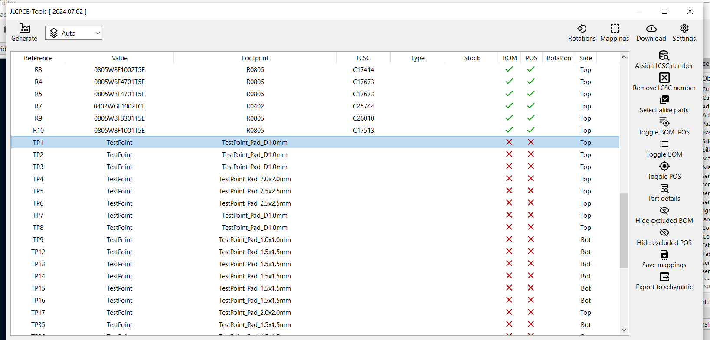
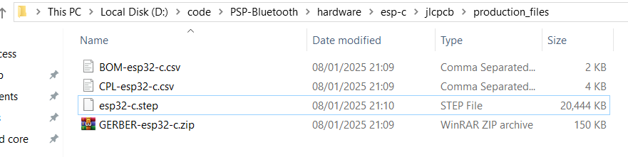

# Generate Gerbers

When generate production files for use with JLCPCB i use a plugin. This generates the Gerbers, zips them and generates the BOM and placement files.

## 1: Install the plugin

Follow the instructions here [https://github.com/Bouni/kicad-jlcpcb-tools](https://github.com/Bouni/kicad-jlcpcb-tools) to install the plugin.

## 2: Generate files

Click `Tools -> External Plugins -> JLCPCB Tools` menu item.

In the menu that opens you can do various things, most commonly remove items from the BOM and placement files.

**NOTE** it often likes to place test pads in the BOM file even though there is no associated part.

If the items listed as `TestPoint` have a green tick under either `BOM` or `POS` you will first need to highlight them in the list. Then click either `Toggle BOM` or `Toggle POS` to remove them from those generated files.

Once ready you can click `Generate` to generate the production files

## 3: Access files

The generated files will exist in `<clone-dir>PSP-Bluetooth\hardware\esp-c\jlcpcb\production_files` and can be uploaded to JLCPCB.

There may or may not be a `.step` file. This is just a 3D model of the PCB.

# Done