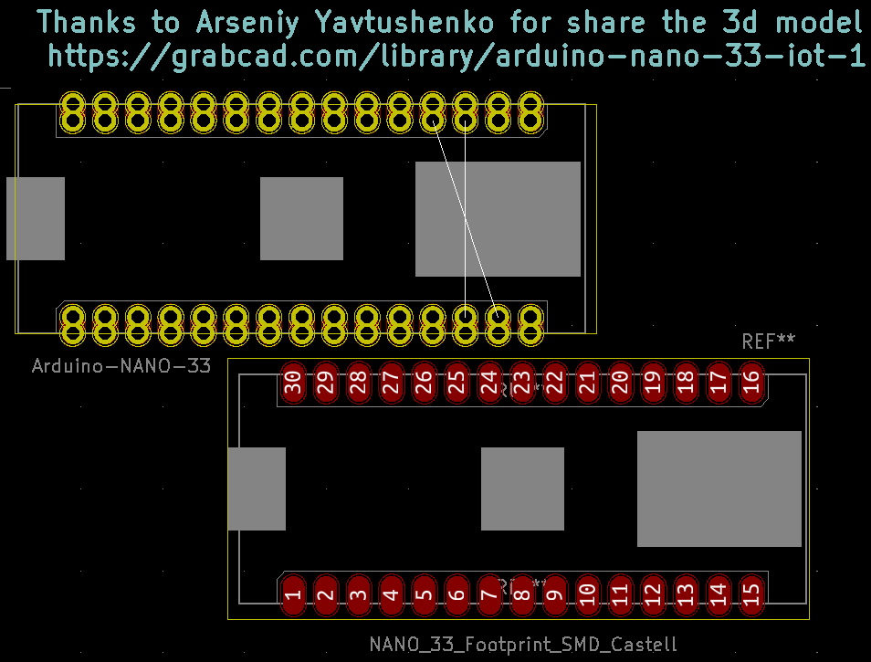
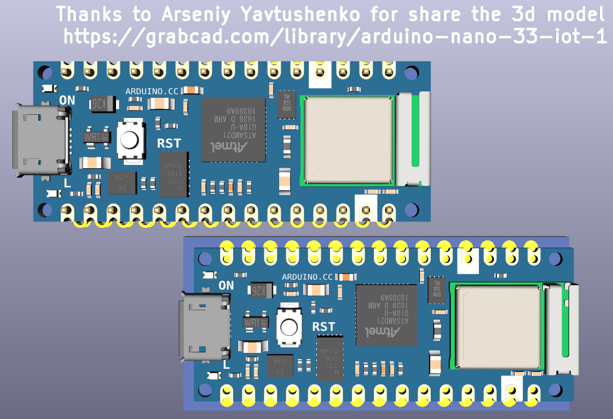
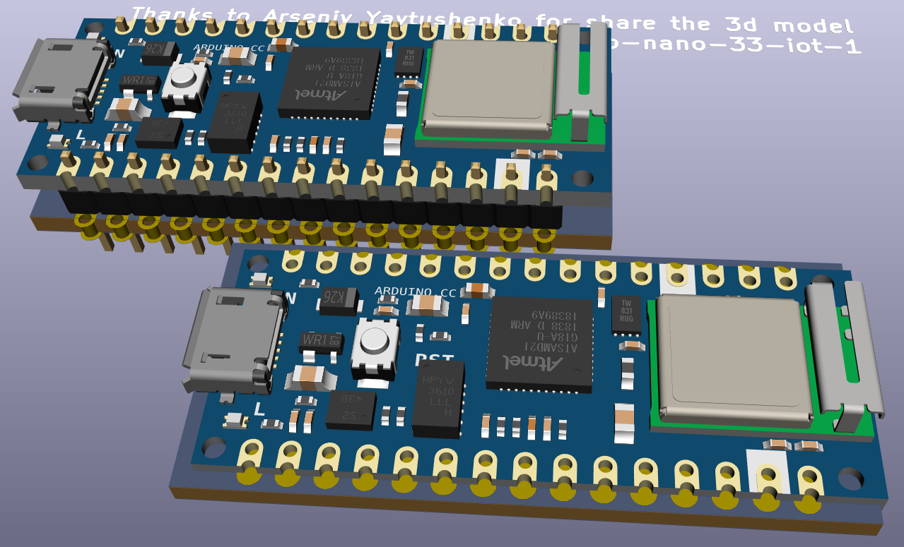

#New footprints for new @arduino  Nano 33 in @kicad_pcb

 
 
 

Instructions for new users in KiCad.
Contributed thanks to: Fred (FrightRisk) https://github.com/FrightRisk

1. Created a "library" folder for all my libraries in /documents/kicad
2. Created an "alias" in "preferences, configure paths" of "LOCALREPO" pointing to the libraries folder
3. Used git clone to clone your repo into my libraries folder
From the main KiCad screen, select "preferences, manage symbol libraries" and click the folder icon to "add existing library to table". I then navigated to my libraries fold and into your Nano_33/lib folder and clicked on Arduino-nano-33.lib and pressed "Ok".
4. From the main KiCad screen, select "preferences manage footprints" and click on the folder icon to "Add existing library to table". I then navigated to my libraries folder and into your Nano_33/nano_33.pretty folder and selected that. I pressed "Ok" to continue.
5. From the main KiCad screen, select "preferences manage footprints" and click on the folder icon to "Add existing library to table". I then navigated to my libraries folder and into your Nano_33/nano_33.pretty folder and selected that. I pressed "Ok" to continue.
6. I then went into the schematic editor and added one of the nano symbols to a new project and tried to then add that to the pcbNew board layout. It failed with an error that J1 did not have an associated footprint. It appears you do not have them linked and have different footprints to select from (footprint_SMD_castell and Socket_Castell). These really should be different boards and have their footprint and 3d model already associated with them. So to fix the problem...
7. I went back to the schematic editor and hovered over the Nano 33 and pressed "E" to edit it (or right click and select "properties, edit properties". Click on the footprint line in the table and find "nano_33" in the tree list on the left and then choose one of the footprints (I chose the socket view). I clicked on the icon in the toolbar that looks like a capacitor mounted to a board to "show footprint in 3d viewer" to see which one I wanted. I then chose the icon next to that to "insert footprint into board" and clicked "ok" on the next screen. Now I was able to go back to the board layout screen and update the board from the schematic and I could see the board. But the 3d model is not associated either so I had to manually do that by...
8. Highlight the board in the pcb layout module and click "E" and then click on the "3d settings" tab on the popup window. Then click on the folder icon and navigate to my library folder and into the "Nano_33" folder, then the "3dModel" folder and select "Arduino_Nano_v3.wrl" file. There is only 1 and it is a very poor image, not the ones shown on the web page. I finally searched on your page and realized that you must have found an image somewhere, but even zooming in on the screen where you show 3d settings, it is unreadable because you have highlighted the line and the colors have no contrast.
9. I found the model I believe you are using here https://grabcad.com/library/arduino-nano-33-iot-1. I downloaded it and unzipped the .stp file and put it with your model. It is 11mb!
10. I now had 3 lines in my 3d editor and selected the nano line since it was sticking through the board perpendicular to it. I had to change rotation to -90 degrees X and 90 degrees Z and then change the Z offset to 4.0mm and X offset to .5. When I zoomed into the image you made, I can see you did the exact same thing. Those pictures just seemed like marketing, with no instructions, I had no idea that was very important to getting things to work.
11. The standard seems for processors in the schematic view to be yellow and have all the pins labeled. Instead, you have tried to have a sort of hybrid graphical image with a white box and shapes for things on the board. The colors of the text and the pin lines, etc. are also all non-standard. I'll try to learn more about KiCad and I'm sure I can fix that.
